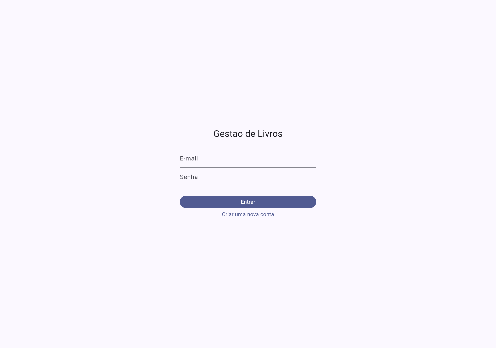
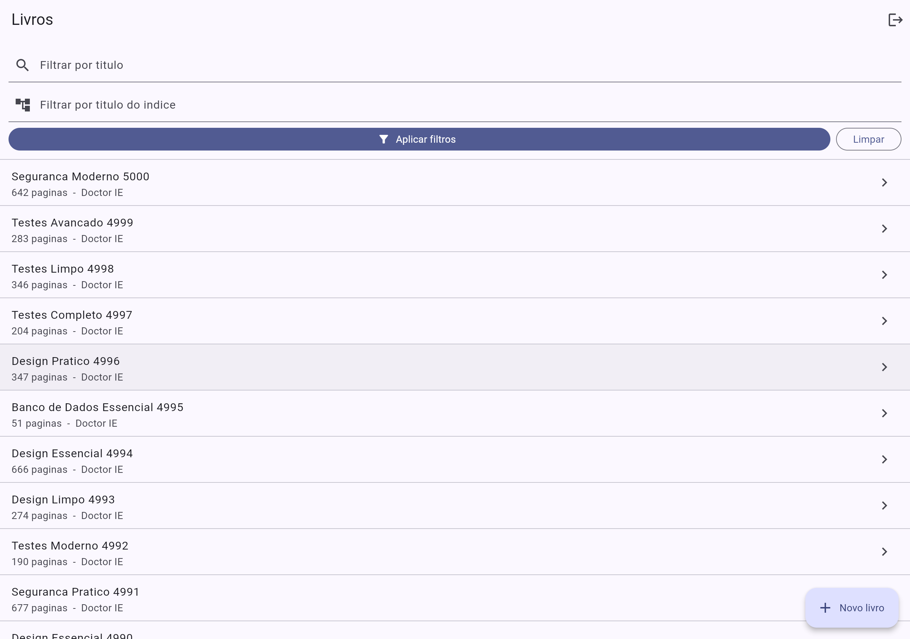
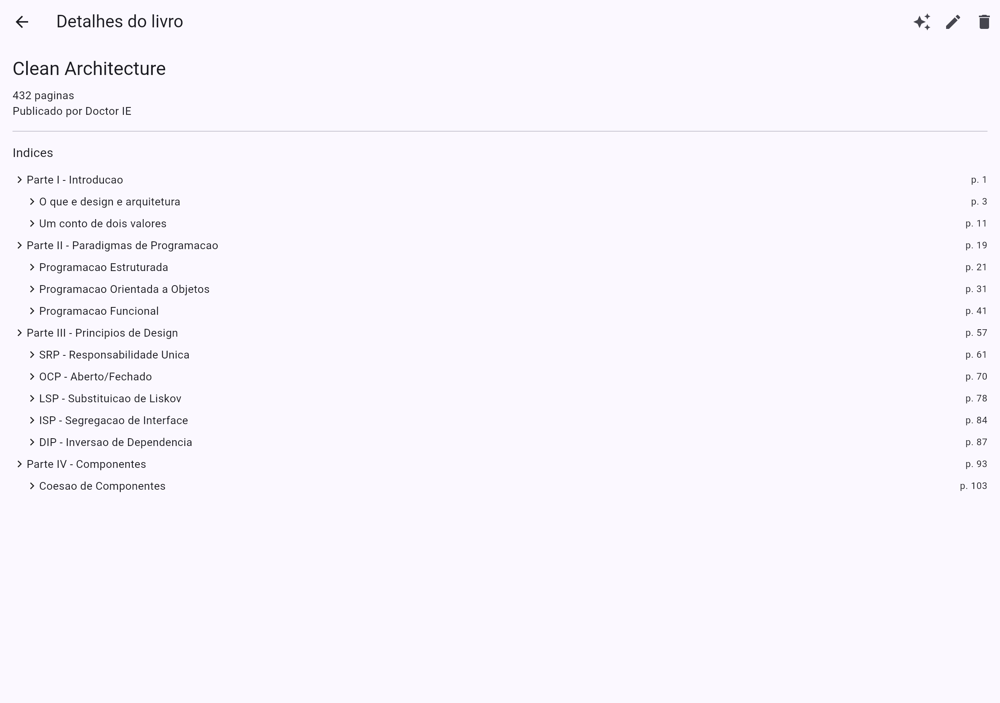
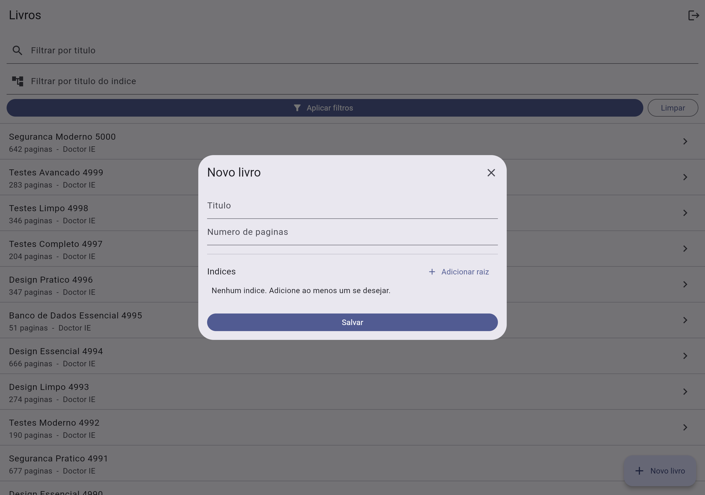
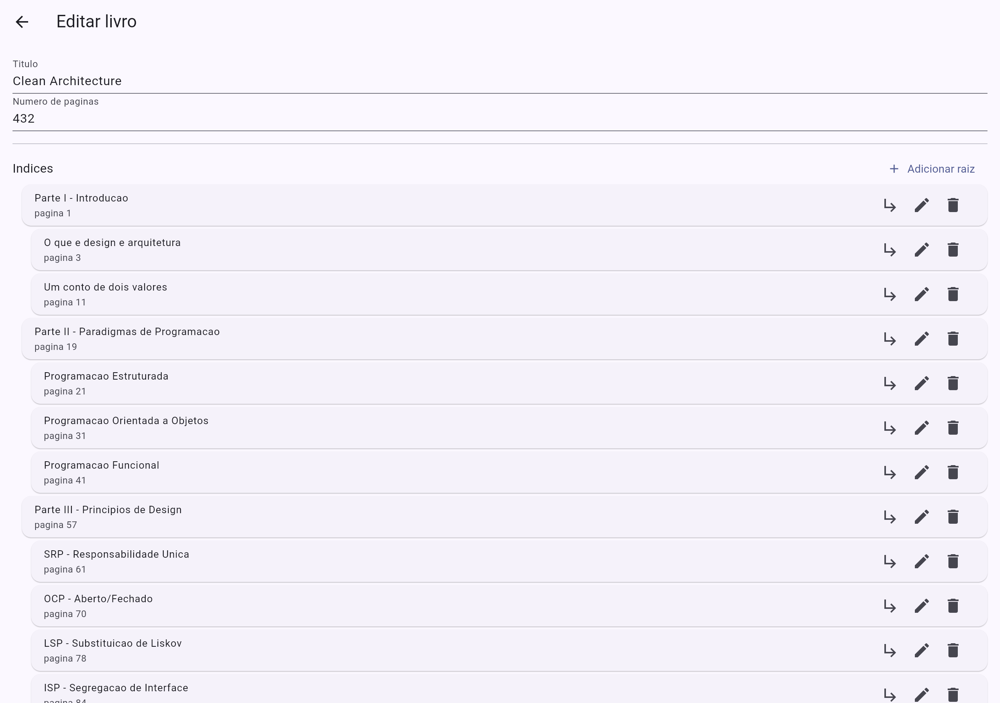

# Gestão de Livros e Índices


Sistema full-stack para cadastro de livros com índices hierárquicos (sumário recursivo),
autenticação por token, filtros de busca e identificação de livros com títulos
semanticamente equivalentes.

- **Backend:** Laravel 12 + PostgreSQL 16 (REST, autenticação Sanctum)
- **Frontend:** Flutter 3 + Riverpod
- **Banco:** PostgreSQL via Docker (extensões `pg_trgm` e `unaccent`)

## Sumário

- [Telas](#telas)
- [Arquitetura](#arquitetura)
- [Modelo de dados](#modelo-de-dados)
- [Decisões técnicas](#decisões-técnicas)
- [Endpoints](#endpoints)
- [Exemplos de API](#exemplos-de-api)
- [Como executar](#como-executar)
- [Testes e verificação](#testes-e-verificação)

---

## Telas

| Login | Listagem + filtros |
|:---:|:---:|
|  |  |

| Detalhe (árvore de índices) | Cadastro (modal) |
|:---:|:---:|
|  |  |

| Edição | Livros similares |
|:---:|:---:|
|  |  |

---

## Arquitetura

O projeto segue uma **arquitetura em camadas modular**: o controller apenas valida e delega,
o serviço concentra a regra de negócio e o model cuida só dos dados.

```
Rota → FormRequest (validação) → Controller → Service → Model / API Resource
```

### Backend (`backend/`)

| Camada | Local | Responsabilidade |
|---|---|---|
| Rotas | `routes/api.php` | Endpoints + middleware (`auth:sanctum`, `throttle`) |
| Validação | `app/Http/Requests/**` | `FormRequest` (inclui validação recursiva da árvore) |
| Controllers | `app/Http/Controllers/**` | Orquestração HTTP, autorização de dono |
| Serviços | `app/Services/**` | `AuthService`, `BookService`, `IndexTreeService`, `SimilarityService` |
| Models | `app/Models/**` | `User`, `Book`, `BookIndex` (Eloquent) |
| Serialização | `app/Http/Resources/**` | Contrato de resposta em português |
| Erros | `bootstrap/app.php` + `app/Exceptions/ApiException.php` | Respostas de erro JSON padronizadas |

### Frontend (`frontend/lib/`)

Estrutura **feature-based**, com a camada de dados separada da UI e estado via Riverpod.

```
core/        api_client (dio + interceptor de token), router, config, token_storage
features/auth/    models, repository, providers, screens
features/books/   models, repository, providers, screens, widgets (árvore recursiva)
```

---

## Modelo de dados

- **users**: `id`, `name`, `email` (único), `password` (hash).
- **books**: `id`, `titulo`, `numero_paginas`, `user_id` (publicador).
- **book_indices**: `id`, `book_id`, `parent_id` (auto-referência), `titulo`, `pagina`, `position`.
  - Estrutura **adjacency list**: recursão ilimitada; `parent_id` nulo = índice raiz.
  - **Cascade**: excluir o livro remove os índices; excluir um índice remove seus subíndices.

---

## Decisões técnicas

### 1. PostgreSQL (em vez de MySQL)
Escolhido pelos três requisitos que ele resolve nativamente e com escala:
- `unaccent` + `pg_trgm` (índice **GIN**) para a similaridade de títulos;
- **Full-Text Search** com dicionário português para a camada semântica;
- **recursive CTE** para resolver os ascendentes de um índice.

### 2. Índices recursivos com adjacency list + recursive CTE
Cada índice referencia o pai (`parent_id`). A resolução de ascendentes (filtro
`titulo_do_indice`) usa o pacote [`staudenmeir/laravel-adjacency-list`](https://github.com/staudenmeir/laravel-adjacency-list),
que expõe `ancestors()`/`descendants()` sobre um recursive CTE testado, evitando SQL cru frágil.
A montagem/poda da árvore fica isolada em `IndexTreeService`.

### 3. Edição por substituição total (replace-all)
Na edição (`PUT /books/{id}`), a árvore inteira é apagada e recriada dentro de uma
transação. Elimina a lógica de diff (casar nós novos/editados/removidos) e é atômica.
Trade-off: os `id` dos índices não são estáveis entre edições — aceitável, pois o app
remonta a árvore ao editar.

### 4. Similaridade semântica: híbrida (pg_trgm + FTS)
`SimilarityService` combina dois sinais, ambos com índice GIN (escala para milhares de registros):
- **pg_trgm** (`similarity` / operador `%`) sobre `f_unaccent(lower(titulo))`: cobre acento,
  caixa e erros de digitação (requisitos de ignorar acento e case-insensitive).
- **Full-Text Search** (`to_tsvector`/`websearch_to_tsquery` em `portuguese`): aproxima
  significado tratando radical, plural e stopwords (ex.: *"Código Limpo"* ≈ *"Códigos Limpos"*).

O score final é uma combinação ponderada dos dois. É uma similaridade **textual + linguística**,
não um embedding semântico puro; a evolução natural (documentada como próximo passo) é adicionar
**pgvector + embeddings**, reaproveitando a mesma estrutura de consulta.

> Observação: `unaccent()` não é `IMMUTABLE` por padrão e não pode ser usada em índice funcional.
> A migration cria um wrapper `f_unaccent()` `IMMUTABLE` para viabilizar o índice GIN.

### 5. Autenticação com Sanctum
Token de API simples, aderente ao requisito de "endpoint de token". Todas as rotas de negócio
ficam sob `auth:sanctum`; login/registro têm `throttle` para mitigar brute-force.

### 6. Contrato de resposta em português
As `API Resources` retornam exatamente as chaves do enunciado (`titulo`, `numero_paginas`,
`usuario_publicador`, `indices`, `subindices`).

---

## Endpoints

| Método | Rota | Descrição |
|---|---|---|
| POST | `/api/auth/register` | Cria usuário, retorna `{token, user}` |
| POST | `/api/auth/login` | Autentica, retorna `{token, user}` |
| GET | `/api/auth/me` | Usuário autenticado |
| POST | `/api/auth/logout` | Revoga o token atual |
| GET | `/api/books` | Lista livros. Filtros: `?titulo=`, `?titulo_do_indice=` |
| POST | `/api/books` | Cria livro com árvore de índices |
| GET | `/api/books/{id}` | Detalha um livro |
| PUT | `/api/books/{id}` | Edita (substitui título, páginas e árvore) |
| DELETE | `/api/books/{id}` | Remove livro (e índices em cascata) |
| GET | `/api/books/similares?titulo=` | Livros similares a um título livre |
| GET | `/api/books/{id}/similares` | Livros similares a um livro existente |

Todas as rotas de livros exigem `Authorization: Bearer <token>`.

---

## Exemplos de API

### Autenticar

```bash
curl -X POST http://localhost:8000/api/auth/login \
  -H 'Content-Type: application/json' \
  -d '{"email":"doctor-ie@example.com","password":"segredo123"}'
# => { "token": "1|abc...", "user": { "id": 1, "nome": "Doctor IE", "email": "..." } }
```

### Criar livro (`POST /api/books`)

Payload com a árvore de índices recursiva:

```json
{
  "titulo": "Clean Code",
  "numero_paginas": 450,
  "indices": [
    {
      "titulo": "Capítulo 1",
      "pagina": 1,
      "subindices": [
        { "titulo": "Introdução", "pagina": 2, "subindices": [] }
      ]
    }
  ]
}
```

### Listar (`GET /api/books`)

Resposta (paginada) no contrato do enunciado:

```json
{
  "data": [
    {
      "id": 1,
      "titulo": "Clean Code",
      "usuario_publicador": { "id": 1, "nome": "Doctor IE" },
      "numero_paginas": 450,
      "indices": [
        {
          "titulo": "Capítulo 1",
          "pagina": 1,
          "subindices": [
            { "titulo": "Introdução", "pagina": 2, "subindices": [] }
          ]
        }
      ]
    }
  ],
  "meta": { "current_page": 1, "last_page": 251, "total": 5008 }
}
```

### Filtros e similaridade

```bash
# Por título
GET /api/books?titulo=clean

# Por título de índice (retorna o livro com o índice casado e seus ascendentes)
GET /api/books?titulo_do_indice=Introdução

# Similares a um título livre (ignora acento/caixa, trata plural/radical)
GET /api/books/similares?titulo=Código Limpo

# Similares a um livro existente
GET /api/books/1/similares
```

---

## Como executar

Há dois caminhos: **tudo via Docker** (recomendado) ou **manual (dev)**.

### Opção A — Docker full-stack (um comando)

```bash
docker compose up -d --build
```

Sobe os três serviços; na primeira subida o backend migra e popula o banco automaticamente:

| Serviço | URL / porta |
|---|---|
| PostgreSQL | `localhost:5433` (com `pg_trgm`/`unaccent`) |
| API (Laravel) | http://localhost:8000 |
| App (Flutter Web) | http://localhost:8080 |

Login demo: **doctor-ie@example.com** / **segredo123**.

### Opção B — Manual (dev)

**Pré-requisitos:** Docker (só p/ o Postgres), PHP 8.2+, Composer, Flutter 3.

```bash
# 1. Banco
docker compose up -d postgres      # Postgres na porta 5433

# 2. Backend
cd backend
composer install
cp .env.example .env               # já aponta para o Postgres do Docker (porta 5433)
php artisan key:generate
php artisan migrate --seed         # schema + dados demo + ~5000 livros (performance)
php artisan serve                  # http://127.0.0.1:8000

# 3. Frontend
cd ../frontend
flutter pub get
flutter run -d chrome              # ou -d windows
# API configurável: flutter run --dart-define=API_BASE_URL=http://127.0.0.1:8000/api
```

---

## Testes e verificação

### Backend
```bash
cd backend
php artisan test
```
Cobre: autenticação e proteção de rotas, CRUD com árvore aninhada, exclusão em cascata,
filtro `titulo_do_indice` retornando ascendentes, e similaridade (fuzzy, acento/caixa e semântica).

### Frontend
```bash
cd frontend
flutter analyze
flutter test        # parsing recursivo do contrato da API
```

### Performance da similaridade
Com ~5000 livros (seeder), a consulta de similaridade usa os índices GIN
(`Bitmap Index Scan` em `books_titulo_trgm_idx` e `books_titulo_tsv_idx`) e executa em
poucos milissegundos. Verificável com `EXPLAIN ANALYZE`.

### Integração contínua
O workflow [`.github/workflows/ci.yml`](.github/workflows/ci.yml) roda a cada push:
testes do backend (Postgres real como service) + `flutter analyze`/`flutter test` no frontend.
